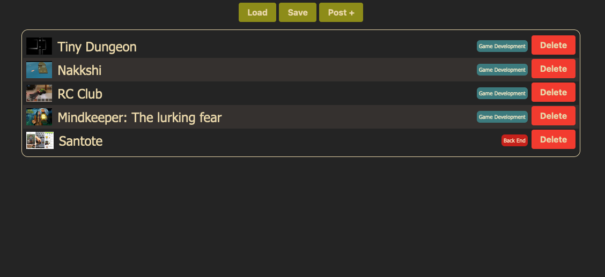
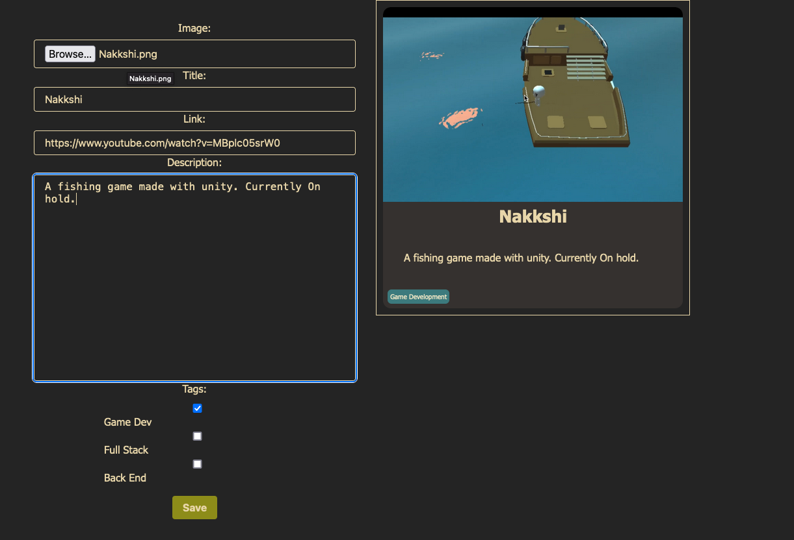

    

Portfolio Item Generator Web Tool

It's a web tool to generate portfolio items for [my personal portfolio](https://portfolio.dankbueno.com/). My personal portfolio reads json data that can be easily generated with this tool.

# Screenshots

_The list of portfolio items_

_The editor to edit portfolio items_

# Functionality

- [x] List portfolio items
- [x] Add portfolio items
- [x] Import data from json
- [x] Export data to json 
- [x] Import data from remote json
- [x] Save data on browser cache

# How to use

1. Clone this repository
2. Open `index.html` in your browser ( recomended to use Live Server extension in VSCode )
3. Add, edit or delete portfolio items
4. Clone my [personal portfolio](https://github.com/Ryuu22/Ryuu22.github.io) and replace the `data.json` file with the one you exported from this tool
5. Customize the portfolio to your liking

# License

This project is licensed under the MIT License - see the [LICENSE.md](LICENSE.md) file for details
